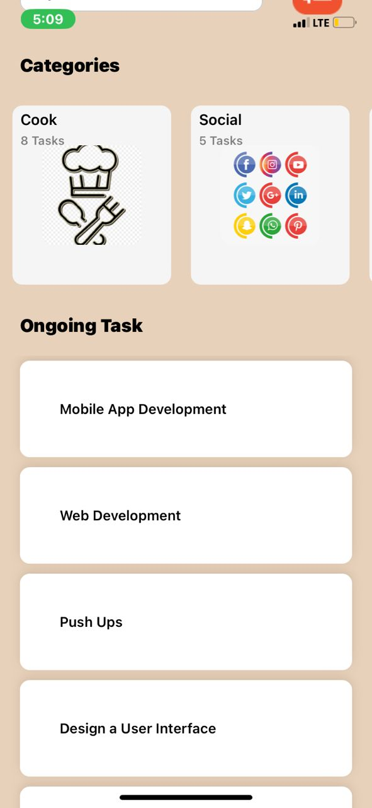
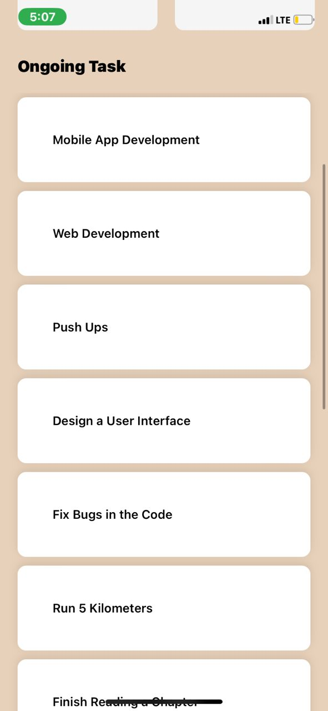

# rn-assignment3-11253585

# React Native Task Manager App

This is a simple task manager app built with React Native. It allows users to categorize tasks and manage them efficiently.

## Custom Components

### 1. Header

The Header component displays a greeting message and the number of tasks for the day. It also includes a user icon.

### 2. CategoryCard

The CategoryCard component represents a category with an image, category name, and the count of tasks within that category.

### 3. TaskItem

The TaskItem component represents an individual task with a task name.

## Screenshots

Screenshots of the app can be found in the `screenshots` directory. Here are the paths for each screenshot:

